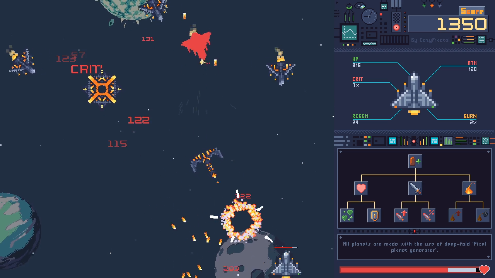
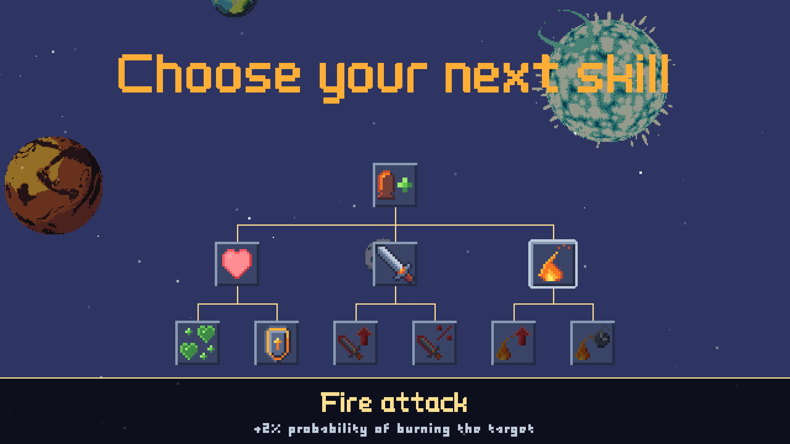
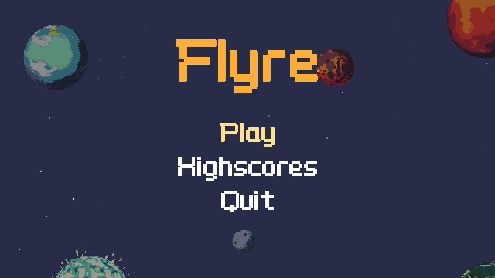

# Flyre

Flyre is a pixel art space shooter with a skill tree.


This repository contains the source code and the assets for 
the game I made in one week for the Pygame community Easter game jam.

### How to run it

The only two dependencies of the game are python 3.8 and pygame 2.0.1.
Once you have both installed, with your favourite tool, for instance
```shell script
python3 -m pip install pygame==2.0.1
```
or maybe
```shell script
poetry install
```
You will be able to run the game as
```shell script
python3.8 flyre.py
```

Otherwise, if you are on windows or linux, builds are available on 
[itch.io](https://cozyfractal.itch.io/flyre). Just download and execute
the one for your platform !


### Features

The game features a skill tree to upgrade your ship in the direction you prefer:


A score board to compare with your friends:


But also:
- 5 different enemies 
- 1 boss
- 9 levels
- An incredible song by @Ploruto
- A purple button
- F tic tac toe
